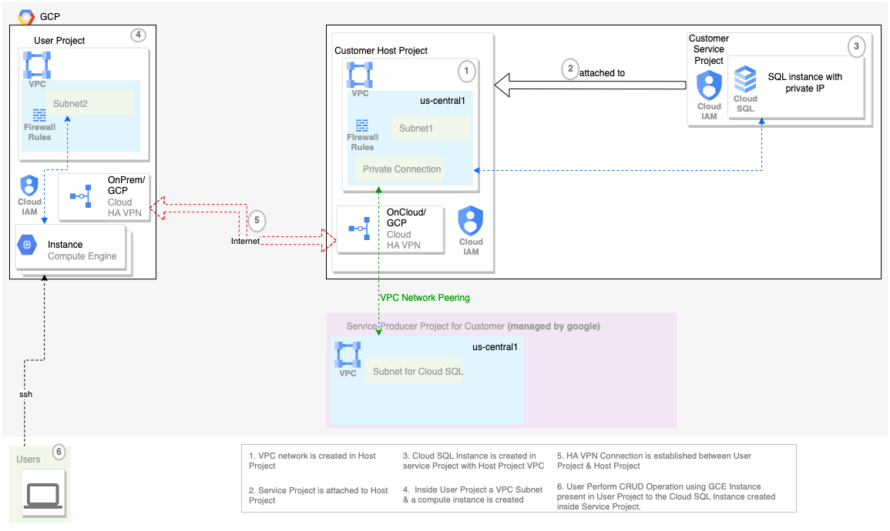

## Introduction

This example solution guides user to establish a HA VPN Connection between a user Project and a Host project having a service project attached to this Host Project.

A third GCP Project is used an HA VPN Connection is established between the VPC of user project and the VPC of host project.

A cloudsql connection is then established using private ip of cloud sql which is created inside the service project and between a VM instance created inside the user project.

## Architecture



## Pre-requisite

1. User should have terraform and gcloud installed in the machine from which they plan to execute this script. Here are the link that describes the [terraform installation](https://developer.hashicorp.com/terraform/tutorials/aws-get-started/install-cli) steps and [gcloud cli installation steps](https://cloud.google.com/sdk/docs/install) .
2. User should have three GCP projects which will be used as part of this guide. First GCP project will act as a Host Project, the Second GCP Project will act as a Service Project and the Third GCP project will act as the user project.
3. User planning to run this script should have following permissions asssigned to them in the respective projects as described below. User can either use webconsole or gcloud cli to assign these permission to the user identity using which these scripts will be executed. User can follow either step `3.a.` or `3.b.` or `3.c.` to complete this step.
   - **Host Project**
      - roles/compute.networkAdmin
      - roles/compute.securityAdmin
      - roles/iam.serviceAccountAdmin
      - roles/serviceusage.serviceUsageAdmin
      - roles/resourcemanager.projectIamAdmin
   - **Service Project**
      - roles/cloudsql.admin
      - roles/compute.instanceAdmin
      - roles/iam.serviceAccountAdmin
      - roles/serviceusage.serviceUsageAdmin
      - roles/resourcemanager.projectIamAdmin
   - **Compute XpnPermission**
      - User should have `roles/compute.xpnAdmin` permission at a common folder owning the host and service project. Here is a [link](https://cloud.google.com/compute/docs/access/iam#compute.xpnAdmin) describing the same. This is required to associate the service project with the host project.
    - **User Project**
      - roles/compute.networkAdmin
      - roles/compute.securityAdmin
      - roles/compute.instanceAdmin
      - roles/iam.serviceAccountUser
      - roles/iam.serviceAccountAdmin
      - roles/serviceusage.serviceUsageAdmin
      - roles/resourcemanager.projectIamAdmin

     a. **Using Webconsole** : User can either use [GCP web console](https://cloud.google.com/iam/docs/grant-role-console) to assign the IAM permission to the user who plans to run this script.

     b. **Using gcloud cli** : User can either use [gcloud cli](https://cloud.google.com/sdk/gcloud/reference/projects/add-iam-policy-binding) to assign IAM permission to the user who plans to run the script.

     c. **[Optionally]** There is a helper script provided which can be used to create a service account with relevant permission at location `cloudsql-easy-networking/helper-scripts/2.createserviceaccount.sh`.

     User can then use this service account and impersonate this service account while running the terraform code. You can read more about the google cloud service account impersonsation [here](https://cloud.google.com/iam/docs/service-account-overview#impersonation).

     Once you have created this service account you can then update `providers.tf.template` file by updating the `impersonate_service_account` field with the service account you have created with appropriate permission as described above and renaming the `providers.tf.template` to `providers.tf` file.

     Once the providers.tf file is updated. The Updated content of `providers.tf` file may look like

      ```
      provider "google" {
        impersonate_service_account = "iac-sa@<GCP-HOST-PROJECT-ID>.iam.gserviceaccount.com"
      }
      provider "google-beta" {
        impersonate_service_account = "iac-sa@<GCP-HOST-PROJECT-ID>.iam.gserviceaccount.com"
      }
      ```

      **Note :** User should have service account admin and projectiam admin permissions in the respective GCP projects in order to assign the above mentioned permissions.


## Execution

1. User should have authenticated using gcloud command `gcloud auth application-default login` command in the cli/machine using which user plans to execute the terraform code. This [link](https://cloud.google.com/sdk/gcloud/reference/auth/application-default/login) describes more detail about the `gcloud auth` command mentioned above.
2. User can now cd in to the example directory `cloudsql-easy-networking/examples/2.VPC-across-VPN` in order to execute the terraform code.
3. Update the variables in **terraform.tfvars** as per your configuration like host_project_id, service_project_id etc. User can also go through the [Inputs](#inputs) section of this readme that describes the list of input variables that can be updated. Here are two [examples](#examples) of the terraform.tfvars file which can be referred while updating your terraform.tfvars file.
4. Enter command `terraform init `. This command initializes the working directory containing terraform configuration files. More description about terraform init can be found at this [link](https://developer.hashicorp.com/terraform/cli/commands/init).
5. Enter command `terraform validate` to validate the configuration files present in this directory. More description about terraform validate can be found at this [link](https://developer.hashicorp.com/terraform/cli/commands/validate).
6. Enter command `terraform plan`.
This command creates an execution plan, which lets you preview the changes that terraform plans to make in your infrastructure. More details about this command can be found at [link](https://developer.hashicorp.com/terraform/cli/commands/plan). Review the content displayed in the plan stage and if all looks good then move to next step.
7. Enter `terraform apply`and type `yes` when asked for confirmation/approval. This command executes the actions proposed in a terraform plan. More details about this command can be found at [link](https://developer.hashicorp.com/terraform/cli/commands/apply).
8. **Deleting resources** : Enter `terraform destroy` and type `yes` when asked for confirmation/approval. This command will delete the resources created using the terraform. More details about this command can be found at [here](https://developer.hashicorp.com/terraform/cli/commands/destroy).

## Examples

1. This example leverages the existing network and subnetwork. Network information like network_name, network_id and subnetword_id should be passed in the terraform.tfvars file. The terraform.tfvars should look like
    ```
    host_project_id        = "<GCP-HOST-PROJECT-ID>"
    service_project_id     = "<GCP-SERVICE-PROJECT-ID>"
    database_version       = "MYSQL_8_0"
    cloudsql_instance_name = "cn-sqlinstance11"
    region                 = "us-central1"
    zone                   = "us-central1-a"
    create_network         = false
    create_subnetwork      = false
    network_name           = "cloudsql-easy"
    subnetwork_name        = "cloudsql-easy-subnet"
    ## User Project Details
    user_project_id            = "<GCP-USER-PROJECT-ID>"
    user_region                = "us-west1"
    user_zone                  = "us-west1-a"
    create_user_vpc_network    = false
    create_user_vpc_subnetwork = false
    uservpc_network_name       = "cloudsql-user"
    uservpc_subnetwork_name    = "cloudsql-user-subnet"
    ```

2. This example creates new network and subnetwork with the provided cidr range.
    ```
    host_project_id        = "<GCP-HOST-PROJECT-ID>"
    service_project_id     = "<GCP-SERVICE-PROJECT-ID>"
    database_version       = "MYSQL_8_0"
    cloudsql_instance_name = "cn-sqlinstance11"
    user_region            = "us-west1"
    user_zone              = "us-west1-a"
    create_network         = true
    create_subnetwork      = true
    network_name           = "cloudsql-easy"
    subnetwork_name        = "cloudsql-easy-subnet"
    subnetwork_ip_cidr     = "10.2.0.0/16"
    ## User Project Details
    user_project_id            = "<GCP-USER-PROJECT-ID>"
    user_region                = "us-central1"
    user_zone                  = "us-central1-a"
    create_user_vpc_network    = true
    create_user_vpc_subnetwork = true
    uservpc_network_name       = "cloudsql-user"
    uservpc_subnetwork_name    = "cloudsql-user-subnet"
    uservpc_subnetwork_ip_cidr = "10.10.30.0/24"
    ```

<!-- BEGIN_TF_DOCS -->
## Requirements

No requirements.

## Providers

| Name | Version |
|------|---------|
| <a name="provider_google"></a> [google](#provider\_google) | 4.81.0 |
| <a name="provider_template"></a> [template](#provider\_template) | 2.2.0 |

## Modules

| Name | Source | Version |
|------|--------|---------|
| <a name="module_firewall_rules"></a> [firewall\_rules](#module\_firewall\_rules) | ../../modules/firewall-rules | n/a |
| <a name="module_gce_sa"></a> [gce\_sa](#module\_gce\_sa) | ../../modules/iam-service-account | n/a |
| <a name="module_google_compute_instance"></a> [google\_compute\_instance](#module\_google\_compute\_instance) | ../../modules/computeinstance | n/a |
| <a name="module_host-vpc"></a> [host-vpc](#module\_host-vpc) | ../../modules/net-vpc | n/a |
| <a name="module_host_project"></a> [host\_project](#module\_host\_project) | ../../modules/services | n/a |
| <a name="module_host_project_vpn"></a> [host\_project\_vpn](#module\_host\_project\_vpn) | ../../modules/net-vpn-ha | n/a |
| <a name="module_project_services"></a> [project\_services](#module\_project\_services) | ../../modules/services | n/a |
| <a name="module_sql-db"></a> [sql-db](#module\_sql-db) | ../../modules/cloudsql | n/a |
| <a name="module_terraform_service_accounts"></a> [terraform\_service\_accounts](#module\_terraform\_service\_accounts) | ../../modules/iam-service-account | n/a |
| <a name="module_user-nat"></a> [user-nat](#module\_user-nat) | ../../modules/net-cloudnat | n/a |
| <a name="module_user-vpc"></a> [user-vpc](#module\_user-vpc) | ../../modules/net-vpc | n/a |
| <a name="module_user_firewall_rules"></a> [user\_firewall\_rules](#module\_user\_firewall\_rules) | ../../modules/firewall-rules | n/a |
| <a name="module_user_gce_sa"></a> [user\_gce\_sa](#module\_user\_gce\_sa) | ../../modules/iam-service-account | n/a |
| <a name="module_user_google_compute_instance"></a> [user\_google\_compute\_instance](#module\_user\_google\_compute\_instance) | ../../modules/computeinstance | n/a |
| <a name="module_user_project_services"></a> [user\_project\_services](#module\_user\_project\_services) | ../../modules/services | n/a |
| <a name="module_user_project_vpn"></a> [user\_project\_vpn](#module\_user\_project\_vpn) | ../../modules/net-vpn-ha | n/a |

## Resources

| Name | Type |
|------|------|
| [google_compute_network.host_vpc](https://registry.terraform.io/providers/hashicorp/google/latest/docs/data-sources/compute_network) | data source |
| [google_compute_network.user_vpc](https://registry.terraform.io/providers/hashicorp/google/latest/docs/data-sources/compute_network) | data source |
| [google_compute_subnetwork.host_vpc_subnetwork](https://registry.terraform.io/providers/hashicorp/google/latest/docs/data-sources/compute_subnetwork) | data source |
| [google_compute_subnetwork.user_vpc_subnetwork](https://registry.terraform.io/providers/hashicorp/google/latest/docs/data-sources/compute_subnetwork) | data source |
| [template_file.mysql_installer](https://registry.terraform.io/providers/hashicorp/template/latest/docs/data-sources/file) | data source |

## Inputs

| Name | Description | Type | Default | Required |
|------|-------------|------|---------|:--------:|
| <a name="input_cloudsql_instance_name"></a> [cloudsql\_instance\_name](#input\_cloudsql\_instance\_name) | Name of the cloud sql instance which will be created. | `string` | n/a | yes |
| <a name="input_database_version"></a> [database\_version](#input\_database\_version) | Database version of the mysql in Cloud SQL . | `string` | n/a | yes |
| <a name="input_host_project_id"></a> [host\_project\_id](#input\_host\_project\_id) | Project Id of the Host GCP Project. | `string` | n/a | yes |
| <a name="input_network_name"></a> [network\_name](#input\_network\_name) | Name of the VPC network to be created if var.create\_network is marked as true or Name of the already existing network if var.create\_network is false. | `string` | n/a | yes |
| <a name="input_region"></a> [region](#input\_region) | Name of a GCP region. | `string` | n/a | yes |
| <a name="input_service_project_id"></a> [service\_project\_id](#input\_service\_project\_id) | Project Id of the Service GCP Project attached to the Host GCP project. | `string` | n/a | yes |
| <a name="input_subnetwork_ip_cidr"></a> [subnetwork\_ip\_cidr](#input\_subnetwork\_ip\_cidr) | CIDR range for the subnet to be created if var.create\_subnetwork is set to true. | `string` | n/a | yes |
| <a name="input_subnetwork_name"></a> [subnetwork\_name](#input\_subnetwork\_name) | Name of the sub network to be created if var.create\_subnetwork is marked as true or Name of the already existing sub network if var.create\_subnetwork is false. | `string` | n/a | yes |
| <a name="input_user_project_id"></a> [user\_project\_id](#input\_user\_project\_id) | Project Id of the User GCP Project. | `string` | n/a | yes |
| <a name="input_user_region"></a> [user\_region](#input\_user\_region) | Name of a GCP region. | `string` | n/a | yes |
| <a name="input_user_zone"></a> [user\_zone](#input\_user\_zone) | Name of a GCP zone, should be in the same region as specified in the user\_region variable. | `string` | n/a | yes |
| <a name="input_uservpc_network_name"></a> [uservpc\_network\_name](#input\_uservpc\_network\_name) | Name of the VPC network to be created if var.create\_user\_vpc\_network is marked as true or Name of the already existing network if var.create\_user\_vpc\_network is false. | `string` | n/a | yes |
| <a name="input_uservpc_subnetwork_ip_cidr"></a> [uservpc\_subnetwork\_ip\_cidr](#input\_uservpc\_subnetwork\_ip\_cidr) | CIDR range for the subnet to be created if var.create\_subnetwork is set to true. | `string` | n/a | yes |
| <a name="input_uservpc_subnetwork_name"></a> [uservpc\_subnetwork\_name](#input\_uservpc\_subnetwork\_name) | Name of the sub network to be created if var.create\_user\_vpc\_subnetwork is marked as true or Name of the already existing sub network if var.create\_user\_vpc\_subnetwork is false.. | `string` | n/a | yes |
| <a name="input_zone"></a> [zone](#input\_zone) | Name of a GCP zone, should be in the same region as specified in the region variable. | `string` | n/a | yes |
| <a name="input_access_config"></a> [access\_config](#input\_access\_config) | Access configurations, i.e. IPs via which the VM instance can be accessed via the Internet. | <pre>object({<br>    nat_ip       = string<br>    network_tier = string<br>  })</pre> | `null` | no |
| <a name="input_cloudsql_private_range_cidr"></a> [cloudsql\_private\_range\_cidr](#input\_cloudsql\_private\_range\_cidr) | Cidr of the private IP range. | `string` | `""` | no |
| <a name="input_cloudsql_private_range_name"></a> [cloudsql\_private\_range\_name](#input\_cloudsql\_private\_range\_name) | Name of the default IP range. | `string` | `"privateip-range"` | no |
| <a name="input_cloudsql_private_range_prefix_length"></a> [cloudsql\_private\_range\_prefix\_length](#input\_cloudsql\_private\_range\_prefix\_length) | Prefix length of the private IP range. | `string` | `"20"` | no |
| <a name="input_create_nat"></a> [create\_nat](#input\_create\_nat) | Boolean variable to create the Cloud NAT for allowing the VM to connect to external Internet. | `bool` | `true` | no |
| <a name="input_create_network"></a> [create\_network](#input\_create\_network) | Variable to determine if a new network should be created or not. | `bool` | `true` | no |
| <a name="input_create_subnetwork"></a> [create\_subnetwork](#input\_create\_subnetwork) | Variable to determine if a new sub network should be created or not. | `bool` | `true` | no |
| <a name="input_create_user_vpc_network"></a> [create\_user\_vpc\_network](#input\_create\_user\_vpc\_network) | Variable to determine if a new network should be created or not. | `bool` | `true` | no |
| <a name="input_create_user_vpc_subnetwork"></a> [create\_user\_vpc\_subnetwork](#input\_create\_user\_vpc\_subnetwork) | Variable to determine if a new sub network should be created or not. | `bool` | `true` | no |
| <a name="input_deletion_protection"></a> [deletion\_protection](#input\_deletion\_protection) | Enable delete protection. | `bool` | `true` | no |
| <a name="input_gce_tags"></a> [gce\_tags](#input\_gce\_tags) | List of tags to be applied to gce instance. | `list(string)` | <pre>[<br>  "cloudsql"<br>]</pre> | no |
| <a name="input_ha_vpn_gateway1_name"></a> [ha\_vpn\_gateway1\_name](#input\_ha\_vpn\_gateway1\_name) | Name of the VPN Gateway at host project. | `string` | `"ha-vpn-1"` | no |
| <a name="input_ha_vpn_gateway2_name"></a> [ha\_vpn\_gateway2\_name](#input\_ha\_vpn\_gateway2\_name) | Name of the VPN Gateway at user project. | `string` | `"ha-vpn-2"` | no |
| <a name="input_nat_name"></a> [nat\_name](#input\_nat\_name) | Name of the cloud nat to be created. | `string` | `"sqleasy-nat"` | no |
| <a name="input_network_routing_mode"></a> [network\_routing\_mode](#input\_network\_routing\_mode) | Network Routing Mode to be used, Could be REGIONAL or GLOBAL. | `string` | `"GLOBAL"` | no |
| <a name="input_network_tier"></a> [network\_tier](#input\_network\_tier) | Networking tier to be used. | `string` | `"STANDARD"` | no |
| <a name="input_router1_asn"></a> [router1\_asn](#input\_router1\_asn) | ASN number required for the router1. | `number` | `64513` | no |
| <a name="input_router2_asn"></a> [router2\_asn](#input\_router2\_asn) | ASN number required for the router2. | `number` | `64514` | no |
| <a name="input_router_name"></a> [router\_name](#input\_router\_name) | Name of the router to be used by the NAT. | `string` | `"sqleasynatrouter"` | no |
| <a name="input_source_image"></a> [source\_image](#input\_source\_image) | Source disk image. If neither source\_image nor source\_image\_family is specified, defaults to the latest public image. | `string` | `""` | no |
| <a name="input_source_image_family"></a> [source\_image\_family](#input\_source\_image\_family) | Source image family. If neither source\_image nor source\_image\_family is specified, defaults to the latest public image. | `string` | `"ubuntu-2204-lts"` | no |
| <a name="input_source_image_project"></a> [source\_image\_project](#input\_source\_image\_project) | Project where the source image comes from. The default project contains images. | `string` | `"ubuntu-os-cloud"` | no |
| <a name="input_test_dbname"></a> [test\_dbname](#input\_test\_dbname) | Database Name to be created from startup script. | `string` | `"test_db"` | no |
| <a name="input_user_network_routing_mode"></a> [user\_network\_routing\_mode](#input\_user\_network\_routing\_mode) | Network Routing Mode to be used, Could be REGIONAL or GLOBAL. | `string` | `"GLOBAL"` | no |

## Outputs

| Name | Description |
|------|-------------|
| <a name="output_cloudsql_instance_name"></a> [cloudsql\_instance\_name](#output\_cloudsql\_instance\_name) | Name of the my cloud sql instance created in the service project. |
| <a name="output_host_network_id"></a> [host\_network\_id](#output\_host\_network\_id) | Network ID for the host VPC network created in the host project. |
| <a name="output_host_psa_ranges"></a> [host\_psa\_ranges](#output\_host\_psa\_ranges) | PSA range allocated for the private service connection in the host vpc. |
| <a name="output_host_subnetwork_id"></a> [host\_subnetwork\_id](#output\_host\_subnetwork\_id) | Sub Network ID created inside the host VPC network created in the host project. |
| <a name="output_host_vpc_name"></a> [host\_vpc\_name](#output\_host\_vpc\_name) | Name of the host VPC created in the host project. |
| <a name="output_user_vpc_name"></a> [user\_vpc\_name](#output\_user\_vpc\_name) | Name of the  VPC created in the user project. |
| <a name="output_uservpc_network_id"></a> [uservpc\_network\_id](#output\_uservpc\_network\_id) | Network ID for the User VPC network created in the user project. |
| <a name="output_uservpc_subnetwork_id"></a> [uservpc\_subnetwork\_id](#output\_uservpc\_subnetwork\_id) | Sub Network ID created inside the User VPC network created in the User project. |
<!-- END_TF_DOCS -->
