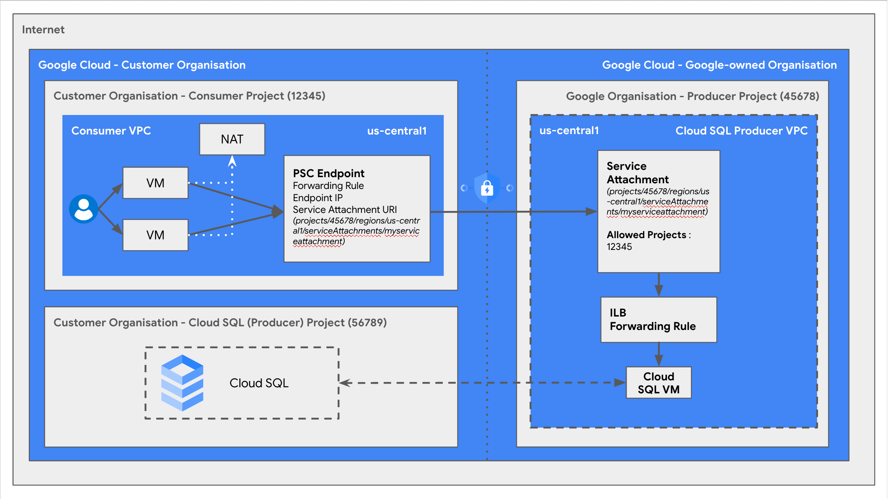

## Introduction

Cloud SQL has a [Private Service Connect](https://cloud.google.com/vpc/docs/private-service-connect) based offering for connectivity where it exposes producer resources using a service attachment when a user creates a Cloud SQL instance. Cloud SQL with enabled PSC connectivity expects the user to create an endpoint to connect to the corresponding service attachment. 

This solution automates the process of creation of Private Service Connect endpoint for the user. You can
[read more](https://cloud.google.com/sql/docs/mysql/configure-private-service-connect) about Private Service Connect for SQL. Here the consumer's project is accessing managed producer services using a private IP address while the producer project is exposing services to consumers' project via service attachments without exposing the SQL instances to the public Internet via a public IP.

Here is a brief overview of the resources being created by the terraform solution :

1.  VPC Network and subnets in the consumer project
2.  Cloud SQL instance in the producer project with PSC enabled (this Cloud SQL instance creates and comes with a Service attachment for PSC connection)
3.  Endpoint in the consumer project to access the Service Attachment
4.  VM instance in the consumer project with Cloud NAT
5.  Firewall rules to allow only authorised instances to connect to Cloud SQL instance
6.  Service account used by the compute instance 
7.  If required, enable services in consumer & producer projects

After the listed resources have been created, this solution connects a VM instance in the consumer project to the Cloud SQL instance.

Note :

-  The TF solution requires an existing consumer project & producer project. 

**Producer Project** : this is a customer owned Google Cloud project in which a customer creates a Cloud SQL instance or any other producer service.

**Consumer Project** : this is a customer owned Google Cloud project which is accessing the producer resources sitting in a producer project through an endpoint in its network. 

-  The region for the service attachment of the PSC enabled SQL instance and the service connect endpoint must be the same

### Benefits:

-   Easily and securely connects your private network (consumer) to access
    Cloud SQL instance (producer).
-   Removes the need to configure an internet gateway or a VPC peering
    connection. Simplify the management of complicated cloud network
    architectures.
-   Prevents your network traffic from being exposed to the public internet. Data
    remains secure on Google’s backbone network.
-   Reduces costs by avoiding public IP addresses.

### Use cases:

-   Managing connectivity across private networks with overlapping CIDR ranges
-   Developing, testing & running production applications that use Cloud SQL

## Architecture



Components : 

1. Customer Organisation : Customer's Organisation on Google Cloud. Customer has created & manages this Google Cloud organisation.
2. Customer Organisation - Consumer Project (12345) : Customer's project on Google Cloud. Customer has created & manages this Google Cloud project. This is the project which accesses the producer services from producer projects created in Customer Organisation - Producer Project (56789).
3. Customer Organisation - Cloud SQL (Producer) Project (56789) : Customer's project on Google Cloud. Customer has created & manages this Google Cloud project. This is the project in which customer creates a producer service such as Cloud SQL.
4. Google-owned Organisation : Google Cloud owned organisation to manage the Cloud projects in which resources are created in consumer projects by customers.
5. Google Organisation - Producer Project (45678) : Google Cloud owned project to manage Cloud resources created in consumer projects by customers.
6. Cloud SQL Producer VPC : Google Cloud project's VPC
7. VM : Customer's Compute Instance in customer consumer project which connects to the producer resources in producer project.
8. NAT : NAT in Customer's project to connect customer's Compute Instance to the internet to retrieve packages for DB connection/creation for the VM.
9. [PSC Endpoint](https://cloud.google.com/vpc/docs/private-service-connect#:~:text=Private%20Service%20Connect%20endpoints%20are,by%20clients%20in%20that%20network.) : Reserved internal IP address in a consumer VPC network with forwarding rule to target Service Attachment for Cloud SQL connection.
10. [Service Attachment](https://cloud.google.com/vpc/docs/private-service-connect#:~:text=Service%20attachments&text=Multiple%20backends%20or%20endpoints%20can,network%20access%20the%20load%20balancer.) : are resources can be accessed by using endpoints. A service attachment targets a producer load balancer and lets clients in a consumer VPC network access the load balancer.
11. Dotted Line : The dashed line in between divides a customer's organisation on Google cloud with customer created projects and Google's organisation with Google created projects.
12. Dot-Dashed Line : The dot-dashed line is a connection showing presence of a NAT in the customer's VPC for the Compute instance to leverage in case of pulling relevant resources to access Cloud SQL.
13. Dashed Line : The dashed line is a connection in between Cloud SQL in customer's project as a producer service and the Cloud SQL running over a VM instance in a Google owned cloud project.

## Prerequisite

1.  User must have terraform and gcloud installed in the machine from which
    they plan to execute the TF templated scripts which are a part of this solution. Here is the link that describes the
    [Terraform installation](https://developer.hashicorp.com/terraform/tutorials/gcp-get-started)
    steps and
    [gcloud CLI Installation Steps](https://cloud.google.com/sdk/docs/install) .
2.  Users should have the Google Cloud projects which will be used as part of
    this guide - customer's consumer and customer's producer.
3.  Users planning to run this TF solution should have following permissions at
    least assigned to them in the respective projects as described below. User
    can either use [GCP web console](https://cloud.google.com/iam/docs/grant-role-console) or [gcloud cli](https://cloud.google.com/sdk/gcloud/reference/projects/add-iam-policy-binding) to assign these permission to the
    user identity that will execute the solution/script.

    -   **Customer's Consumer Project**
        -   roles/compute.networkAdmin
        -   roles/compute.securityAdmin
        -   roles/iam.serviceAccountAdmin
        -   roles/serviceusage.serviceUsageAdmin
        -   roles/resourcemanager.projectIamAdmin
        -   roles/compute.instanceAdmin

    -   **Customer's Producer Project**

        -   roles/cloudsql.admin
        -   roles/iam.serviceAccountAdmin
        -   roles/serviceusage.serviceUsageAdmin
        -   roles/resourcemanager.projectIamAdmin

## Execution

1.  Authenticate using gcloud command `gcloud auth
    application-default login` in the cli/machine that will execute the terraform solution. This
    [link](https://cloud.google.com/sdk/gcloud/reference/auth/application-default/login)
    describes more detail about the `gcloud auth` command mentioned above.
2.  Change directory `cd` in to the example directory
    `cloudsql-easy-networking/examples/3.PSC` in order to execute the
    terraform code.
3.  Update the variables in **terraform.tfvars** as per your configuration like
    consumer_project_id, producer_project_id etc. User can also go through the
    [Inputs](#inputs) section of this readme that describes the list of input
    variables that can be updated. Here are two [examples](#examples) of the
    terraform.tfvars file which can be referred while updating your
    terraform.tfvars file.
4.  Run the command `terraform init`. This command initializes the working
    directory containing terraform configuration files. More description about
    [terraform init](https://developer.hashicorp.com/terraform/cli/commands/init).
5.  Run the command `terraform validate` to validate the configuration files
    present in this directory. More description about [terraform validate](https://developer.hashicorp.com/terraform/cli/commands/validate).
6.  Run the command `terraform plan`. This command creates an execution plan,
    which lets you preview the changes that terraform plans to make in your
    infrastructure. More details about [terraform plan](https://developer.hashicorp.com/terraform/cli/commands/plan) command.Review the content displayed in the plan stage and if all looks good then move to
    next step.
7.  Run the `terraform apply`and type `yes` when asked for confirmation/approval.
    This command executes the actions proposed in a terraform plan. More details
    about [terraform apply](https://developer.hashicorp.com/terraform/cli/commands/apply).
8.  **Deleting resources** : Enter `terraform destroy` and type `yes` when asked
    for confirmation/approval. This command will delete the resources created
    using the terraform. More details about [terraform destroy](https://developer.hashicorp.com/terraform/cli/commands/destroy).

## Examples

This example leverages the existing network and subnetwork. Network information
like consumer_network_name, consumer_project_id and consumer_subnetwork_name
should be passed in the terraform.tfvars file. If an existing network doesn't
exist with the same configuration, terraform shall create a new
network/subnetwork with the provided details. The terraform.tfvars should look
like :

~~~
```
## Producer Project tfvars
cloudsql_instance_name   = "cloudsql-easy-instance"
database_version         = "MYSQL_8_0"
producer_cidr            = "192.168.0.0/16"
producer_project_id      = "<Producer Project>"
deletion_protection      = "false"

## Consumer Project tfvars
consumer_cidr            = "10.0.0.0/16"
consumer_network_name    = "cloudsql-easy"
consumer_project_id      = "<Consumer Project>"
consumer_subnetwork_name = "cloudsql-easy-subnet"

## Common
region                   = "us-central1"
zone                     = "us-central1-a"
```
~~~

<!-- BEGIN_TF_DOCS -->
## Requirements

No requirements.

## Providers

| Name | Version |
|------|---------|
| <a name="provider_google"></a> [google](#provider\_google) | 4.84.0 |
| <a name="provider_template"></a> [template](#provider\_template) | 2.2.0 |

## Modules

| Name | Source | Version |
|------|--------|---------|
| <a name="module_compute_address"></a> [compute\_address](#module\_compute\_address) | terraform-google-modules/address/google | n/a |
| <a name="module_consumer_nat"></a> [consumer\_nat](#module\_consumer\_nat) | ../../modules/net-cloudnat | n/a |
| <a name="module_consumer_project"></a> [consumer\_project](#module\_consumer\_project) | ../../modules/services | n/a |
| <a name="module_consumer_vpc"></a> [consumer\_vpc](#module\_consumer\_vpc) | ../../modules/net-vpc | n/a |
| <a name="module_firewall_rules"></a> [firewall\_rules](#module\_firewall\_rules) | ../../modules/firewall-rules | n/a |
| <a name="module_gce_sa"></a> [gce\_sa](#module\_gce\_sa) | ../../modules/iam-service-account | n/a |
| <a name="module_google_compute_instance"></a> [google\_compute\_instance](#module\_google\_compute\_instance) | ../../modules/computeinstance | n/a |
| <a name="module_producer_project"></a> [producer\_project](#module\_producer\_project) | ../../modules/services | n/a |
| <a name="module_sql_db"></a> [sql\_db](#module\_sql\_db) | ../../modules/cloudsql | n/a |
| <a name="module_terraform_service_accounts"></a> [terraform\_service\_accounts](#module\_terraform\_service\_accounts) | ../../modules/iam-service-account | n/a |

## Resources

| Name | Type |
|------|------|
| [google_compute_forwarding_rule.cloudsql_forwarding_rule](https://registry.terraform.io/providers/hashicorp/google/latest/docs/resources/compute_forwarding_rule) | resource |
| [google_compute_network.consumer_vpc](https://registry.terraform.io/providers/hashicorp/google/latest/docs/data-sources/compute_network) | data source |
| [google_compute_subnetwork.consumer_vpc_subnetwork](https://registry.terraform.io/providers/hashicorp/google/latest/docs/data-sources/compute_subnetwork) | data source |
| [template_file.mysql_installer](https://registry.terraform.io/providers/hashicorp/template/latest/docs/data-sources/file) | data source |

## Inputs

| Name | Description | Type | Default | Required |
|------|-------------|------|---------|:--------:|
| <a name="input_cloudsql_instance_name"></a> [cloudsql\_instance\_name](#input\_cloudsql\_instance\_name) | Name of the cloud sql instance which will be created. | `string` | n/a | yes |
| <a name="input_consumer_cidr"></a> [consumer\_cidr](#input\_consumer\_cidr) | CIDR Range of the Consumer VPC | `string` | n/a | yes |
| <a name="input_consumer_network_name"></a> [consumer\_network\_name](#input\_consumer\_network\_name) | Name of the network to be created in Consumer project | `string` | n/a | yes |
| <a name="input_consumer_project_id"></a> [consumer\_project\_id](#input\_consumer\_project\_id) | Project ID of the Consumer GCP Project. | `string` | n/a | yes |
| <a name="input_consumer_subnetwork_name"></a> [consumer\_subnetwork\_name](#input\_consumer\_subnetwork\_name) | Name of the subnetwork to be created in Consumer project | `string` | n/a | yes |
| <a name="input_create_mysql_db"></a> [create\_mysql\_db](#input\_create\_mysql\_db) | Bool value to create MySQL DB | `bool` | `true` | no |
| <a name="input_create_nat"></a> [create\_nat](#input\_create\_nat) | Boolean variable to create the Cloud NAT for allowing the VM to connect to external Internet. | `bool` | `true` | no |
| <a name="input_create_network"></a> [create\_network](#input\_create\_network) | Variable to determine if a new network should be created or not. | `bool` | `true` | no |
| <a name="input_create_postgresql_db"></a> [create\_postgresql\_db](#input\_create\_postgresql\_db) | Bool value to create Postgres DB | `bool` | `false` | no |
| <a name="input_create_subnetwork"></a> [create\_subnetwork](#input\_create\_subnetwork) | Variable to determine if a new sub network should be created or not. | `bool` | `true` | no |
| <a name="input_database_version"></a> [database\_version](#input\_database\_version) | Database version of the mysql in Cloud SQL . | `string` | n/a | yes |
| <a name="input_deletion_protection"></a> [deletion\_protection](#input\_deletion\_protection) | Enable delete protection. | `bool` | `true` | no |
| <a name="input_gce_tags"></a> [gce\_tags](#input\_gce\_tags) | List of tags to be applied to gce instance. | `list(string)` | <pre>[<br>  "cloudsql"<br>]</pre> | no |
| <a name="input_load_balancing_scheme"></a> [load\_balancing\_scheme](#input\_load\_balancing\_scheme) | Load Balacing Scheme for the ILB/Forwarding Rule | `string` | `""` | no |
| <a name="input_nat_name"></a> [nat\_name](#input\_nat\_name) | Name of the cloud nat to be created. | `string` | `"sqleasy-nat"` | no |
| <a name="input_producer_project_id"></a> [producer\_project\_id](#input\_producer\_project\_id) | Project ID of the Producer GCP Project. | `string` | n/a | yes |
| <a name="input_region"></a> [region](#input\_region) | Name of a GCP region. | `string` | n/a | yes |
| <a name="input_reserved_ips"></a> [reserved\_ips](#input\_reserved\_ips) | IP to reserve for connecting to the SQL instance. | `list(string)` | <pre>[<br>  "10.0.0.5"<br>]</pre> | no |
| <a name="input_router_name"></a> [router\_name](#input\_router\_name) | Name of the router to be used by the NAT. | `string` | `"sqleasynatrouter-1"` | no |
| <a name="input_source_image"></a> [source\_image](#input\_source\_image) | Source disk image. If neither source\_image nor source\_image\_family is specified, defaults to the latest public image. | `string` | `""` | no |
| <a name="input_source_image_family"></a> [source\_image\_family](#input\_source\_image\_family) | Source image family. If neither source\_image nor source\_image\_family is specified, defaults to the latest public image. | `string` | `"ubuntu-2204-lts"` | no |
| <a name="input_source_image_project"></a> [source\_image\_project](#input\_source\_image\_project) | Project where the source image comes from. The default project contains images. | `string` | `"ubuntu-os-cloud"` | no |
| <a name="input_test_dbname"></a> [test\_dbname](#input\_test\_dbname) | Test DB being created inside the Cloud SQL isntance | `string` | `"test"` | no |
| <a name="input_zone"></a> [zone](#input\_zone) | Name of a GCP zone, should be in the same region as specified in the region variable. | `string` | n/a | yes |

## Outputs

| Name | Description |
|------|-------------|
| <a name="output_cloudsql_instance_name"></a> [cloudsql\_instance\_name](#output\_cloudsql\_instance\_name) | Name of the SQL instance created in the producer project. |
| <a name="output_cloudsql_instance_psc_attachment"></a> [cloudsql\_instance\_psc\_attachment](#output\_cloudsql\_instance\_psc\_attachment) | The psc\_service\_attachment\_link created for the master instance |
| <a name="output_compute_instance_name"></a> [compute\_instance\_name](#output\_compute\_instance\_name) | Name of the compute instance created |
| <a name="output_consumer_network_id"></a> [consumer\_network\_id](#output\_consumer\_network\_id) | Network ID for the consumer VPC network created in the consumer project. |
| <a name="output_consumer_network_name"></a> [consumer\_network\_name](#output\_consumer\_network\_name) | Name of the consumer VPC |
| <a name="output_consumer_subnetwork_id"></a> [consumer\_subnetwork\_id](#output\_consumer\_subnetwork\_id) | Sub Network ID created inside the consumer VPC network created in the consumer project. |
| <a name="output_reserved_ip"></a> [reserved\_ip](#output\_reserved\_ip) | IP Address reserved as service endpoint |
<!-- END_TF_DOCS -->