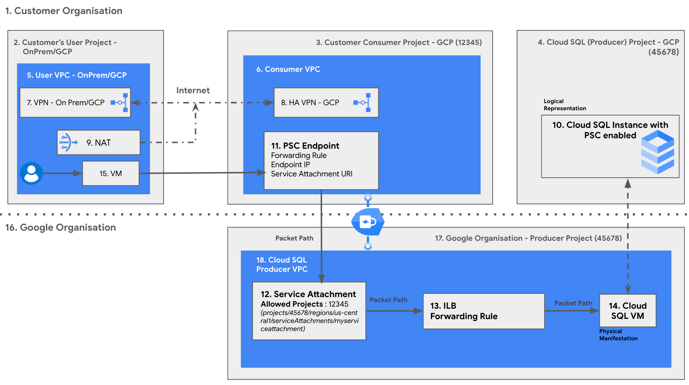

## Introduction

Cloud SQL has a [Private Service Connect](https://cloud.google.com/sql/docs/mysql/configure-private-service-connect) based offering for connectivity where it exposes producer resources using a service attachment when a user creates a Cloud SQL instance accesed from on-premises customer network via HA VPN. Cloud SQL with enabled PSC connectivity expects the user to create an endpoint to connect to the corresponding service attachment. 

This solution automates the process of creation of Private Service Connect endpoint for the user. You can
[read more](https://cloud.google.com/blog/products/networking/three-consumer-private-service-connect-designs#:~:text=Components%20of%20Design) about Private Service Connect for SQL. Here the customer's user project is accessing managed producer services using a private IP address (Service Connect Endpoint in customer's consumer project) via HA VPN (from customer's user project's VM). The customer's producer project is exposing services to a consumer project via service attachments without exposing the SQL instances to the public Internet. Customer's user and consumer projects are connected using a hybrid networking solution - [Cloud HA VPN](https://cloud.google.com/network-connectivity/docs/vpn/concepts/overview#ha-vpn).

Here is a brief overview of the resources being created by the terraform solution :

1. VPC Networks and Subnets in customer's consumer and user projects
2. Configures an HA VPN connection between customer's consumer and user projects
3. Cloud SQL instance in customer's producer project with PSC enabled (this Cloud SQL instance creates and comes with a Service attachment for PSC connection)
4. PSC Endpoint in the customer's consumer project to access the Service Attachment with a forwarding rule to the Service Attachment URI
5. VM instance in the customer's user project with Cloud NAT
6. Firewall rules to allow only authorised instances to connect to Cloud SQL instance
7. Service account used by the compute instance 
8. If required, enable services in consumer & producer projects

Note :

-  The terraform solution requires existing customer's user, consumer & producer projects:

**User Project** : this is a customer owned Google Cloud project from which the customer is trying to access the Cloud SQL instance or any other producer service. This could be on-prem or Google Cloud Platform.

**Producer Project** : this is a customer owned Google Cloud project in which a customer creates a Cloud SQL instance or any other producer service

**Consumer Project** : this is a customer owned Google Cloud project which is accessing the producer resources through a PSC Endpoint in its network

-  The region for the service attachment of the PSC enabled SQL instance and the service connect endpoint must be the same

### Benefits

1. Easily and securely connects your private on-prem network (user) to access Cloud SQL instance (producer)
2. Removes the need to configure a VPC peering connection simplifying the management of complicated cloud network architectures
3. Prevents your network traffic from being exposed to the public internet. Data remains secure on Google’s backbone network
4. Reduces costs by avoiding public IP addresses
5. Improves performance and reliability by using HA VPN

### Use cases

1. Connecting to Cloud SQL instances from on-premises networks
2. Developing and testing applications that use Cloud SQL
3. Running production applications that use Cloud SQL

## Architecture



## Components

1. Customer Organisation : Customer's Organisation on Google Cloud. Customer has created & manages this Google Cloud organisation.
2. Customer Organisation - User Project : Customer's project on-prem or on Google Cloud. Customer has created & manages this Google Cloud project. This is the project which contains the virtual machine/instance accessing the producer service such as Cloud SQL using the service connect endpoint.
3. Customer Organisation - Consumer Project (12345) : Customer's project on Google Cloud. Customer has created & manages this Google Cloud project. This is the project which contains the service connect endpoint as a part of its network to access the producer services from producer projects created in Customer Organisation - Producer Project (56789).
4. Customer Organisation - Cloud SQL (Producer) Project (56789) : Customer's project on Google Cloud. Customer has created & manages this Google Cloud project. This is the project in which customer creates a producer service such as Cloud SQL.
5. User VPC - OnPrem/Google Cloud Platform : Customer's user project (Google Cloud Platform or on-prem) VPC which is used for connecting with Google Cloud Platform network using VPN.
6. Consumer VPC : Customer's consumer project (Google Cloud Platform) VPC which is used for connecting with on-prem network using VPN and create a service connect endpoint to access the producer services.
7. VPN - On Prem/Google Cloud Platform : On Prem VPN solution used by customer to connect to Google Cloud Platform.
8. [HA VPN - Google Cloud Platform](https://cloud.google.com/network-connectivity/docs/vpn/concepts/key-terms#:~:text=Replaces%20Classic%20VPN%20with%20a%20gateway%20that%20provides%20a%2099.99%25%20availability%20SLA.) : HA VPN Google Cloud Platform solution to provide high availability to customer's connection between the user and consumer projects.
9. NAT : NAT in Customer's user project to connect customer's VM Instance to the internet to retrieve packages for DB connection/creation for the VM.
10. Cloud SQL Instance : Cloud SQL instance created in customer's producer project which is created with PSC enabled. 
11. [PSC Endpoint](https://cloud.google.com/vpc/docs/private-service-connect#:~:text=Private%20Service%20Connect%20endpoints%20are,by%20clients%20in%20that%20network.) : Reserved internal IP address in a consumer VPC network with forwarding rule to target Service Attachment for Cloud SQL connection.
12. [Service Attachment](https://cloud.google.com/vpc/docs/private-service-connect#:~:text=Service%20attachments&text=Multiple%20backends%20or%20endpoints%20can,network%20access%20the%20load%20balancer.) : are resources can be accessed by using endpoints. A service attachment targets a producer load balancer and lets clients in a consumer VPC network access the load balancer.
13. ILB Forwarding Rule : Forwarding rule to forward requests directed to service connect endpoint to the service attachment URI
14. Cloud SQL VM : Physical manifestation of the Cloud SQL instance in customer's producer project
15. VM : Customer's VM Instance in customer user project/on-premises which connects to the producer resources through consumer project
16. Google-owned Organisation : Google Cloud owned organisation to manage the Cloud projects in which resources are created in consumer projects by customers
17. Google Organisation - Producer Project (45678) : Google Cloud owned project to manage Cloud resources created in consumer projects by customers
18. Cloud SQL Producer VPC : Google Cloud project's VPC
19. Dotted Line : The dashed line in between divides a customer's organisation on Google cloud with customer created projects and Google's organisation with Google created projects
20. Dot-Dashed Line : The dot-dashed line is a connection showing presence of a NAT in the customer's VPC for the VM instance to leverage in case of pulling relevant resources to access Cloud SQL
21. Dashed Line : The dashed line is a connection in between Cloud SQL in customer's project as a producer service and the Cloud SQL running over a VM instance in a Google owned cloud project

## Pre-requisite

1.  User must have terraform and gcloud installed in the machine from which
    they plan to execute the terraform templated scripts which are a part of this solution. Here is the link that describes the
    [Terraform installation](https://developer.hashicorp.com/terraform/tutorials/gcp-get-started)
    steps and
    [gcloud CLI Installation Steps](https://cloud.google.com/sdk/docs/install) .
2.  Users should have the Google Cloud projects which will be used as part of
    this guide - consumer/host and producer/service and user/on-prem.
3. Users planning to run this terraform solution should have following permissions at
    least assigned to them in the respective projects as described below. User
    can either use [Google Cloud Platform console](https://cloud.google.com/iam/docs/grant-role-console) or [gcloud cli](https://cloud.google.com/sdk/gcloud/reference/projects/add-iam-policy-binding) to assign these permission to the user identity that will execute the solution/script.

    -   **Customer's Consumer Project**
        -   roles/compute.networkAdmin
        -   roles/compute.securityAdmin
        -   roles/iam.serviceAccountAdmin
        -   roles/serviceusage.serviceUsageAdmin
        -   roles/resourcemanager.projectIamAdmin
    -   **Customer's Producer Project**
        -   roles/cloudsql.admin
        -   roles/iam.serviceAccountAdmin
        -   roles/serviceusage.serviceUsageAdmin
        -   roles/resourcemanager.projectIamAdmin
    -   **Customer's User Project**
        - roles/compute.networkAdmin
        - roles/compute.securityAdmin
        - roles/compute.instanceAdmin
        - roles/iam.serviceAccountUser
        - roles/iam.serviceAccountAdmin
        - roles/serviceusage.serviceUsageAdmin
        - roles/resourcemanager.projectIamAdmin
`
To assign these roles to the account : 

  a. **Using Webconsole** : User can either use [Google Cloud Platform web console](https://cloud.google.com/iam/docs/grant-role-console) to assign the IAM permission to the user who plans to run this script.

  b. **Using gcloud cli** : User can either use [gcloud cli](https://cloud.google.com/sdk/gcloud/reference/projects/add-iam-policy-binding) to assign IAM permission to the user who plans to run the script.

## Execution

1.  Authenticate using gcloud command `gcloud auth
    application-default login` in the cli/machine that will execute the terraform solution. This
    [link](https://cloud.google.com/sdk/gcloud/reference/auth/application-default/login)
    describes more detail about the `gcloud auth` command mentioned above.
2.  Change directory `cd` in to the example directory
    `cloudsql-easy-networking/examples/4.PSC-Across-VPN` in order to execute the
    terraform code.
3.  Update the variables in **terraform.tfvars** as per your configuration like
    host_project_id, service_project_id etc. User can also go through the
    [Inputs](#inputs) section of this readme that describes the list of input
    variables that can be updated. Here are [examples](#examples) of the
    terraform.tfvars file which can be referred while updating your
    terraform.tfvars file.
4.  Run the command `terraform init`. This command initializes the working
    directory containing terraform configuration files. More description about
    [terraform init](https://developer.hashicorp.com/terraform/cli/commands/init).
5.  Run the command `terraform validate` to validate the configuration files
    present in this directory. More description about [terraform validate](https://developer.hashicorp.com/terraform/cli/commands/validate).
6.  Run the command `terraform plan`. This command creates an execution plan,
    which lets you preview the changes that terraform plans to make in your
    infrastructure. More details about [terraform plan](https://developer.hashicorp.com/terraform/cli/commands/plan) command.Review the content displayed in the plan stage and if all looks good then move to
    next step.
7.  Run the `terraform apply`and type `yes` when asked for confirmation/approval.
    This command executes the actions proposed in a terraform plan. More details
    about [terraform apply](https://developer.hashicorp.com/terraform/cli/commands/apply).
8.  **Deleting resources** : Enter `terraform destroy` and type `yes` when asked
    for confirmation/approval. This command will delete the resources created
    using the terraform. More details about [terraform destroy](https://developer.hashicorp.com/terraform/cli/commands/destroy).

## Examples

Here's an example of the tfvars file that can be used to create the resources using Terraform for using PSC across VPN connection with another Google Cloud project or on-prem project. This examples creates a new VPC and subnetwork in user and consumer projects.

```

## Producer/Service Project tfvars

producer_project_id        = <<producer-project-ID>>
test_dbname                = "test_db"

## Consumer/Host Project tfvars

consumer_project_id        = <<consumer-project-ID>>
create_network             = true
create_subnetwork          = true
consumer_network_name      = "vpn-vpc-consumer"
consumer_subnetwork_name   = "vpn-subnet-consumer"
consumer_cidr              = "192.168.0.0/24"
endpoint_ip                = ["192.168.0.5"]
region                     = "us-central1"
zone                       = "us-central1-a"
router_name                = "cloudsqleasy-router"

## User/On-Prem Project tfvars

user_project_id            = <<user-project-ID>>
create_user_vpc_network    = true
create_user_vpc_subnetwork = true
user_network_name          = "vpn-vpc-user"
user_subnetwork_name       = "vpn-subnet-user"
user_cidr                  = "10.0.0.0/24"
nat_name                   = "cloudsqleasy-nat"
user_region                = "us-central1"
user_zone                  = "us-central1-a"
```

~~

<!-- BEGIN_TF_DOCS -->
## Requirements

No requirements.

## Providers

| Name | Version |
|------|---------|
| <a name="provider_google"></a> [google](#provider\_google) | 4.84.0 |
| <a name="provider_template"></a> [template](#provider\_template) | 2.2.0 |

## Modules

| Name | Source | Version |
|------|--------|---------|
| <a name="module_compute_address"></a> [compute\_address](#module\_compute\_address) | terraform-google-modules/address/google | n/a |
| <a name="module_consumer_project"></a> [consumer\_project](#module\_consumer\_project) | ../../modules/services | n/a |
| <a name="module_consumer_project_vpn"></a> [consumer\_project\_vpn](#module\_consumer\_project\_vpn) | ../../modules/net-vpn-ha | n/a |
| <a name="module_consumer_vpc"></a> [consumer\_vpc](#module\_consumer\_vpc) | ../../modules/net-vpc | n/a |
| <a name="module_firewall_rules"></a> [firewall\_rules](#module\_firewall\_rules) | ../../modules/firewall-rules | n/a |
| <a name="module_producer_project"></a> [producer\_project](#module\_producer\_project) | ../../modules/services | n/a |
| <a name="module_sql_db"></a> [sql\_db](#module\_sql\_db) | ../../modules/cloudsql | n/a |
| <a name="module_terraform_service_accounts"></a> [terraform\_service\_accounts](#module\_terraform\_service\_accounts) | ../../modules/iam-service-account | n/a |
| <a name="module_user_firewall_rules"></a> [user\_firewall\_rules](#module\_user\_firewall\_rules) | ../../modules/firewall-rules | n/a |
| <a name="module_user_gce_sa"></a> [user\_gce\_sa](#module\_user\_gce\_sa) | ../../modules/iam-service-account | n/a |
| <a name="module_user_nat"></a> [user\_nat](#module\_user\_nat) | ../../modules/net-cloudnat | n/a |
| <a name="module_user_project"></a> [user\_project](#module\_user\_project) | ../../modules/services | n/a |
| <a name="module_user_project_instance"></a> [user\_project\_instance](#module\_user\_project\_instance) | ../../modules/computeinstance | n/a |
| <a name="module_user_project_vpn"></a> [user\_project\_vpn](#module\_user\_project\_vpn) | ../../modules/net-vpn-ha | n/a |
| <a name="module_user_vpc"></a> [user\_vpc](#module\_user\_vpc) | ../../modules/net-vpc | n/a |

## Resources

| Name | Type |
|------|------|
| [google_compute_forwarding_rule.cloudsql_forwarding_rule](https://registry.terraform.io/providers/hashicorp/google/latest/docs/resources/compute_forwarding_rule) | resource |
| [google_compute_network.consumer_vpc](https://registry.terraform.io/providers/hashicorp/google/latest/docs/data-sources/compute_network) | data source |
| [google_compute_network.user_vpc](https://registry.terraform.io/providers/hashicorp/google/latest/docs/data-sources/compute_network) | data source |
| [google_compute_subnetwork.consumer_vpc_subnetwork](https://registry.terraform.io/providers/hashicorp/google/latest/docs/data-sources/compute_subnetwork) | data source |
| [google_compute_subnetwork.user_vpc_subnetwork](https://registry.terraform.io/providers/hashicorp/google/latest/docs/data-sources/compute_subnetwork) | data source |
| [template_file.mysql_installer](https://registry.terraform.io/providers/hashicorp/template/latest/docs/data-sources/file) | data source |

## Inputs

| Name | Description | Type | Default | Required |
|------|-------------|------|---------|:--------:|
| <a name="input_cloudsql_instance_name"></a> [cloudsql\_instance\_name](#input\_cloudsql\_instance\_name) | Name of the cloud sql instance which will be created. | `string` | `"cloudsql"` | no |
| <a name="input_consumer_cidr"></a> [consumer\_cidr](#input\_consumer\_cidr) | CIDR range of the consumer VPC Network | `string` | n/a | yes |
| <a name="input_consumer_gateway_name"></a> [consumer\_gateway\_name](#input\_consumer\_gateway\_name) | Name of the consumer Gateway. | `string` | `"gcp-vpc-gateway1"` | no |
| <a name="input_consumer_network_name"></a> [consumer\_network\_name](#input\_consumer\_network\_name) | Name of the Consumer VPC network to be created if var.create\_network is marked as true or Name of the already existing network if var.create\_network is false. | `string` | n/a | yes |
| <a name="input_consumer_project_id"></a> [consumer\_project\_id](#input\_consumer\_project\_id) | Project ID of the Consumer GCP Project. | `string` | n/a | yes |
| <a name="input_consumer_subnetwork_name"></a> [consumer\_subnetwork\_name](#input\_consumer\_subnetwork\_name) | Name of the Consumer sub network to be created if var.create\_subnetwork is marked as true or Name of the already existing sub network if var.create\_subnetwork is false. | `string` | n/a | yes |
| <a name="input_create_mysql_db"></a> [create\_mysql\_db](#input\_create\_mysql\_db) | Flag to check if an mysql db needs to be created | `bool` | `true` | no |
| <a name="input_create_nat"></a> [create\_nat](#input\_create\_nat) | Boolean variable to create the Cloud NAT for allowing the VM to connect to external Internet. | `bool` | `true` | no |
| <a name="input_create_network"></a> [create\_network](#input\_create\_network) | Variable to determine if a new network should be created or not. | `bool` | `true` | no |
| <a name="input_create_postgresql_db"></a> [create\_postgresql\_db](#input\_create\_postgresql\_db) | Bool value to create Postgres DB | `bool` | `false` | no |
| <a name="input_create_subnetwork"></a> [create\_subnetwork](#input\_create\_subnetwork) | Variable to determine if a new sub network should be created or not. | `bool` | `true` | no |
| <a name="input_create_user_vpc_network"></a> [create\_user\_vpc\_network](#input\_create\_user\_vpc\_network) | Variable to determine if a new network should be created or not. | `bool` | `true` | no |
| <a name="input_create_user_vpc_subnetwork"></a> [create\_user\_vpc\_subnetwork](#input\_create\_user\_vpc\_subnetwork) | Variable to determine if a new sub network should be created or not. | `bool` | `true` | no |
| <a name="input_database_version"></a> [database\_version](#input\_database\_version) | Database version of the mysql in Cloud SQL . | `string` | `"MYSQL_8_0"` | no |
| <a name="input_deletion_protection"></a> [deletion\_protection](#input\_deletion\_protection) | Enable delete protection. | `bool` | `true` | no |
| <a name="input_endpoint_ip"></a> [endpoint\_ip](#input\_endpoint\_ip) | Endpoint IP address to be reserved for PSC connection | `list(string)` | n/a | yes |
| <a name="input_gce_tags"></a> [gce\_tags](#input\_gce\_tags) | List of tags to be applied to gce instance. | `list(string)` | <pre>[<br>  "cloudsql"<br>]</pre> | no |
| <a name="input_load_balancing_scheme"></a> [load\_balancing\_scheme](#input\_load\_balancing\_scheme) | Load Balacing Scheme for the ILB/Forwarding Rule | `string` | `""` | no |
| <a name="input_nat_name"></a> [nat\_name](#input\_nat\_name) | Name of the NAT connection for the VM instance to communicate to the internet. | `string` | n/a | yes |
| <a name="input_producer_project_id"></a> [producer\_project\_id](#input\_producer\_project\_id) | Project ID of the Producer GCP Project. | `string` | n/a | yes |
| <a name="input_region"></a> [region](#input\_region) | Name of a GCP region. | `string` | n/a | yes |
| <a name="input_router_name"></a> [router\_name](#input\_router\_name) | Name of the router for Cloud NAT. | `string` | n/a | yes |
| <a name="input_source_image"></a> [source\_image](#input\_source\_image) | Source disk image. If neither source\_image nor source\_image\_family is specified, defaults to the latest public image. | `string` | `""` | no |
| <a name="input_source_image_family"></a> [source\_image\_family](#input\_source\_image\_family) | Source image family. If neither source\_image nor source\_image\_family is specified, defaults to the latest public image. | `string` | `"ubuntu-2204-lts"` | no |
| <a name="input_source_image_project"></a> [source\_image\_project](#input\_source\_image\_project) | Project where the source image comes from. The default project contains images. | `string` | `"ubuntu-os-cloud"` | no |
| <a name="input_terraform-sa"></a> [terraform-sa](#input\_terraform-sa) | Service Account to be used by Terraform | `string` | `"terraform-sa"` | no |
| <a name="input_test_dbname"></a> [test\_dbname](#input\_test\_dbname) | Name of the DB to be created inside the SQL instance | `string` | `"test_db"` | no |
| <a name="input_user_cidr"></a> [user\_cidr](#input\_user\_cidr) | CIDR range of the user VPC Network | `string` | n/a | yes |
| <a name="input_user_gateway_name"></a> [user\_gateway\_name](#input\_user\_gateway\_name) | Name of the user Gateway. | `string` | `"gcp-vpc-gateway2"` | no |
| <a name="input_user_network_name"></a> [user\_network\_name](#input\_user\_network\_name) | Name of the User VPC network to be created if var.create\_network is marked as true or Name of the already existing network if var.create\_network is false. | `string` | n/a | yes |
| <a name="input_user_project_id"></a> [user\_project\_id](#input\_user\_project\_id) | Project ID of the User GCP Project. | `string` | n/a | yes |
| <a name="input_user_region"></a> [user\_region](#input\_user\_region) | Region for the user cloud entities | `string` | n/a | yes |
| <a name="input_user_subnetwork_name"></a> [user\_subnetwork\_name](#input\_user\_subnetwork\_name) | Name of the User sub network to be created if var.create\_subnetwork is marked as true or Name of the already existing sub network if var.create\_subnetwork is false. | `string` | n/a | yes |
| <a name="input_user_zone"></a> [user\_zone](#input\_user\_zone) | Zone for the user cloud entities | `string` | n/a | yes |
| <a name="input_zone"></a> [zone](#input\_zone) | Name of a GCP zone, should be in the same region as specified in the region variable. | `string` | n/a | yes |

## Outputs

| Name | Description |
|------|-------------|
| <a name="output_cloudsql_instance_name"></a> [cloudsql\_instance\_name](#output\_cloudsql\_instance\_name) | Name of the SQL instance created in the producer project. |
| <a name="output_cloudsql_instance_psc_attachment"></a> [cloudsql\_instance\_psc\_attachment](#output\_cloudsql\_instance\_psc\_attachment) | The psc\_service\_attachment\_link created for the master instance |
| <a name="output_compute_instance_name"></a> [compute\_instance\_name](#output\_compute\_instance\_name) | Name of the compute instance created |
| <a name="output_consumer_network_id"></a> [consumer\_network\_id](#output\_consumer\_network\_id) | Network ID for the consumer VPC network created in the consumer project. |
| <a name="output_consumer_network_name"></a> [consumer\_network\_name](#output\_consumer\_network\_name) | Name of the consumer VPC |
| <a name="output_consumer_subnetwork_id"></a> [consumer\_subnetwork\_id](#output\_consumer\_subnetwork\_id) | Sub Network ID created inside the consumer VPC network created in the consumer project. |
| <a name="output_reserved_ip"></a> [reserved\_ip](#output\_reserved\_ip) | IP Address reserved as service endpoint |
<!-- END_TF_DOCS -->